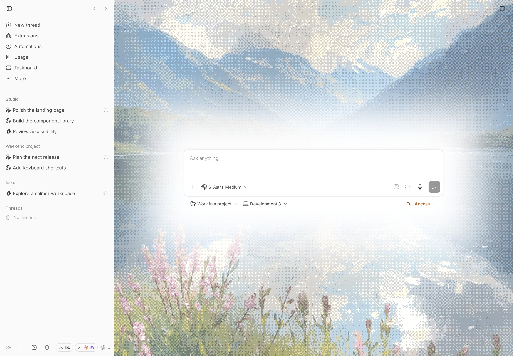
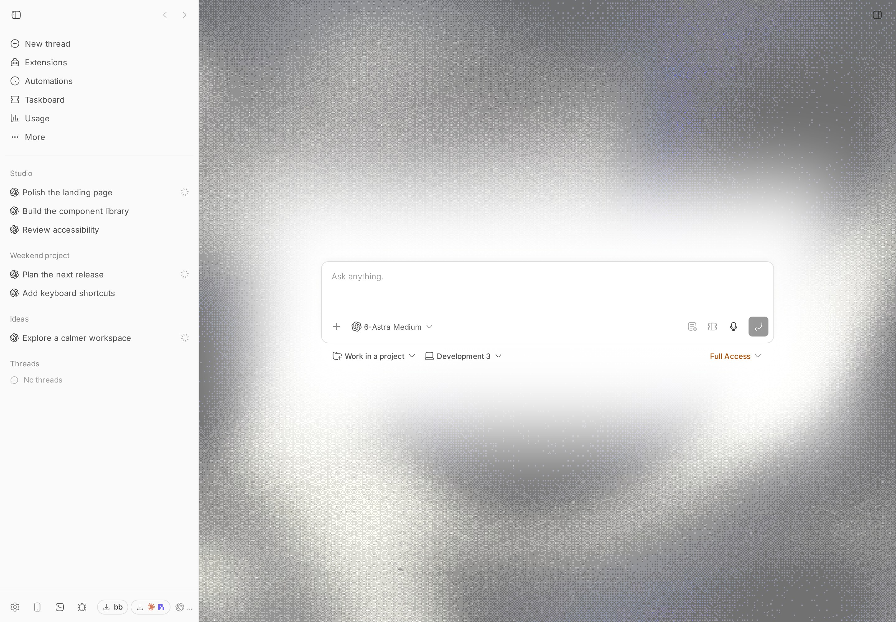

# Aura

Personal PNG/JPG backgrounds, Capy's animated dithering effect, and six saved
slots for BB. Open **Settings → Aura**, or **+ → Actions → Aura** in a thread panel.

## Use Aura

- Choose or drop a PNG/JPG (up to 32 MB). Large images are resized automatically
  to fit the 2 MB stored-image limit. The preview shows the result before saving.
- Adjust image visibility (0–100%), dimming behind the composer, fit, and Capy dithering.
  Image dimming follows the centered composer; the wallpaper remains visible
  at the bottom and edges. Photo dithering now animates with a gentle threshold wave.
- Select **Apply background** to apply the current draft.
- Choose a slot, enter a name, and select **Save slot** to save and apply the draft.
  Occupied slots have an explicit **Replace slot** button. Each slot keeps its
  image and appearance independently; click its card to switch immediately.
- **New thread screen only** hides Aura inside existing conversations. Apply it
  to save. This scope and the Enabled preference remain global when switching slots.
- **Clear** removes a saved slot without removing the currently displayed image.
  **Reset to default** restores the noise effect while keeping your saved slots
  and global scope/enabled preferences.

Settings and slots are shared across this BB server and its remote clients.
The current window updates immediately; other windows refresh on focus or within
15 seconds. Images stay in plugin-owned SQLite and are served through a
BB-authenticated image route. Images are not sent to Capy or included in prompts.

## Install

Requires BB 0.40+ and SDK 0.4.21+. From the workspace root:

```sh
npm install
npm run check --workspace bb-plugin-aura
bb plugin install ./plugins/aura --yes
bb plugin reload aura
```

Install the Git release after publication:

```sh
bb plugin install git:https://github.com/MateoCerquetella/bb-plugins.git@^0.2.0 \
  --subdirectory plugins/aura --tag-prefix aura/
```




## CLI

```sh
bb aura status --json
bb aura slots
bb aura use 1
bb aura new-thread-only on
bb aura new-thread-only off
bb aura enable
bb aura disable
bb aura reset
```

Use the settings UI to upload and save slots. CLI output contains metadata,
never image bytes.

## Reading and composing

Existing conversations have an opaque, theme-colored reading column. Background
images remain undimmed in the side margins, never directly behind message text.
Composer dimming applies only to the New thread screen.
The New thread composer is vertically centered on the full compose screen; short
windows and long drafts remain scrollable. These styles follow Aura's enable and
scope settings and are removed when Aura is disabled.

## Effect and verification

The shader and fade masks come from [Capy](https://capy.ai/new). Source URLs and
the Paper Shaders Apache-2.0 license are recorded in
[THIRD_PARTY_NOTICES.md](./THIRD_PARTY_NOTICES.md). Runtime requests stay local.

Aura decorates BB's `root-compose-main-panel` and `thread-detail-timeline-panel`
DOM containers. Recheck these host names when upgrading BB. Canvas/GL resources,
observers and listeners are disposed when disabling or reloading. Noise and photo animation
run at up to 30 fps and pauses off-screen, when hidden, and for reduced motion.
The image/gradient remains if WebGL is unavailable.

```sh
npm run check --workspace bb-plugin-aura
```

Unit tests cover atomic apply/rejection, six-slot persistence and replacement,
global scope across switches, deletion/reset, legacy settings, and DOM cleanup
when switching to New thread only. The opt-in live browser test additionally
checks real uploads, slot switching, and the scope toggle while preserving the
user's active image and saved slots.
