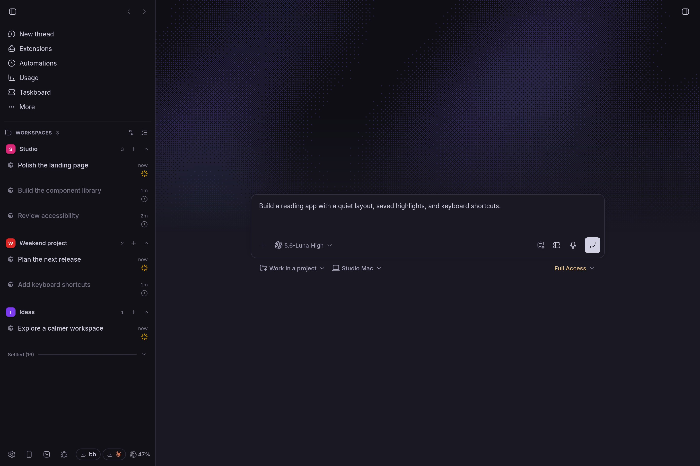
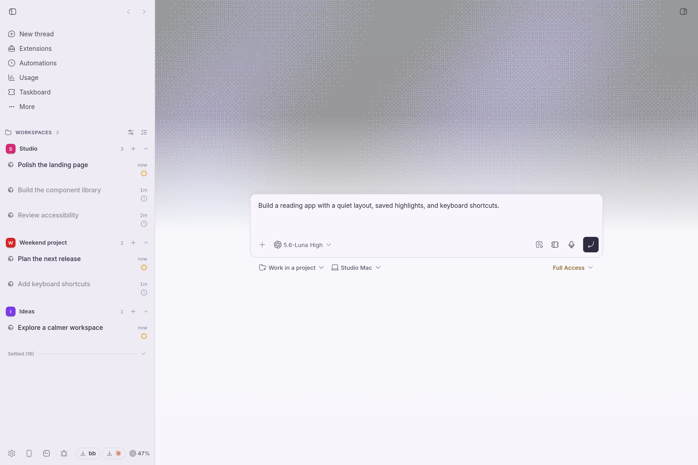
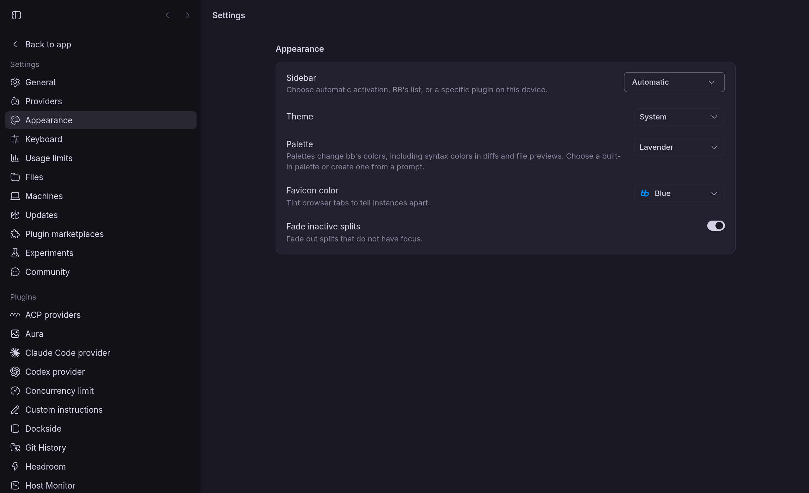
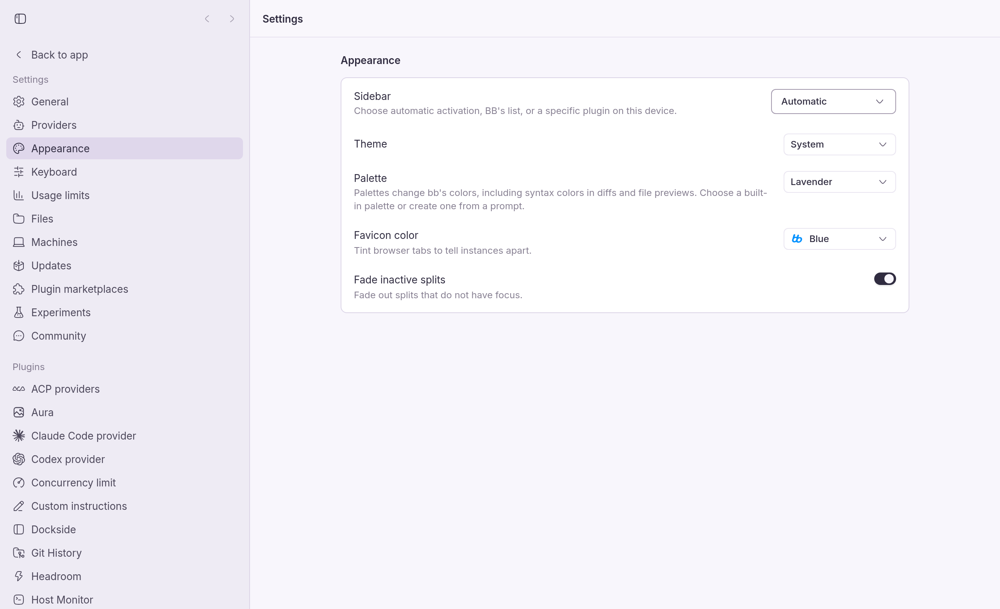

# Lavender

A soft violet palette for BB. Dark mode pairs a near-black sidebar with charcoal-purple panels and lilac accents; light mode uses pale lavender surfaces with deeper violet accents. Conversations, menus and code previews share coordinated colors.

## Install

Install the Git release:

```sh
bb plugin install git:https://github.com/MateoCerquetella/bb-plugins.git@^0.1.0 --subdirectory plugins/lavender --tag-prefix lavender/
```


From this workspace root:

```sh
npm install
npm run check --workspace bb-plugin-lavender
bb plugin install ./plugins/lavender --yes
bb plugin reload lavender
bb theme set plugin:lavender:lavender
```

Or select **Lavender** in **Settings → Appearance** after installation. The palette follows each client's Light, Dark or System mode. Palette selection is shared across BB windows; mode remains per client.

This plugin changes native color tokens only. It keeps your layout, fonts and wallpaper settings. Both syntax themes ship locally; it makes no network requests and stores no user data.

To return to the default palette, run `bb theme reset`. Disabling or removing Lavender also lets BB fall back to its default palette.

## Preview

New thread with sample projects, threads, and an unsent draft. The optional wallpaper shown is provided by Aura; Lavender supplies the UI colors.







## Development

Requires BB 0.40+; uses the workspace-pinned Plugin SDK 0.4.21.

```sh
npm run check --workspace bb-plugin-lavender
```

Checks cover text and semantic contrast, the manifest's local theme assets, and a server build. The stylesheet uses BB's supported `:root, .light` and `.dark` selectors. Terminal colors and typography retain BB's defaults.
