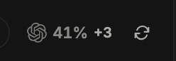
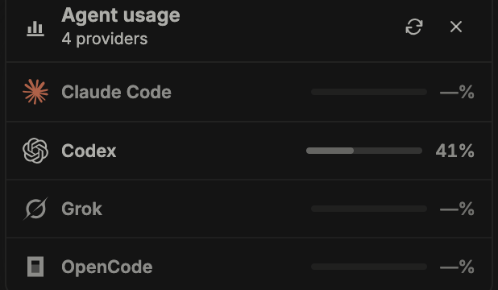
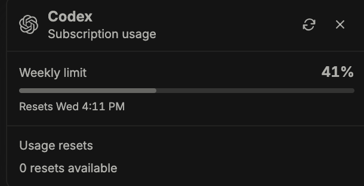

<p align="center">
  
</p>

<h1 align="center">Usage Tracker for BB</h1>

<p align="center">
  Codex, Claude Code, Cursor, Grok, OpenCode, and Antigravity limits in BB's sidebar footer.
</p>

<p align="center">
  
  <a href="./LICENSE"></a>
</p>

Usage Tracker adds one compact, live strip beside BB's existing sidebar
utility icons. Claude Code, Codex, Grok, OpenCode, and Antigravity each show a progress bar
and their current usage reading, without adding a navigation item or a separate
plugin page.

<p align="center">
  
</p>

<p align="center">
  
</p>

<p align="center">
  
</p>

## Features

- Shows Codex, Claude Code, Cursor, Grok, OpenCode, and Antigravity usage in BB's sidebar footer.
- Lets you show or hide every provider independently; the strip compacts for
  one or two providers and summarizes larger sets with the highest usage plus
  an additional-provider count. It disappears when every provider is disabled.
- Opens the summary into a complete provider overview; select any overview row
  to drill into that provider's existing limit details.
- Colors usage yellow from 80% and red from 95% in both compact and expanded
  progress displays.
- Lets you choose whether the compact percentage and progress bar show the
  weekly or five-hour limit. Weekly is the default.
- Expands any provider to show its five-hour, weekly, and additional
  provider-defined percentages.
- Shows reported USD credit usage and limits in expanded details, including the
  dollar amounts exposed by Claude Code usage data.
- Works with BB's Account Pooler: when pooled accounts serve Claude Code or
  Codex, the strip shows their combined, plan-weighted usage and the expanded
  details list every pooled account's own limits.
- Shows the available Codex usage resets in the expanded details.
- Includes reset timing and provider session status in the expanded view.
- Refreshes automatically every five minutes and whenever a stale BB window
  becomes active again.
- Provides one manual refresh button for all providers.
- Preserves last-known limit windows through temporary errors, expired
  sessions, and rate limits.
- Cleans up its UI on plugin reload, disable, or removal and works alongside a
  custom thread list such as t3sidebar.

The configurable Compact limit was contributed by
[Stephen Dolan (@stephendolan)](https://github.com/stephendolan).

## Install

Usage Tracker requires BB 0.38 or newer. Install its tracking Git release:

```sh
bb plugin install git:https://github.com/MateoCerquetella/bb-plugins.git@^0.1.9 --subdirectory plugins/usage-tracker --tag-prefix usage-tracker/
```

After [the BB Community entry](https://github.com/get-bb/marketplace/pull/129)
is updated and live, the equivalent shorthand is:

```sh
bb plugin install usage-tracker
```

The strip appears in the bottom of the sidebar as soon as the plugin loads.
The BB-backed providers are enabled by default; Antigravity is opt-in. Change them independently under
**Settings → Plugins → Usage Tracker**. The same page lets you choose
between the weekly and five-hour limit for the compact reading.

The provider CLIs must be installed and signed in for BB to report their usage:

```sh
codex login
claude
grok login
opencode auth login
```

Antigravity quota probing runs in the background from a cached snapshot, so it
does not add its 3–4 second CLI startup time to the sidebar RPC response.

If a CLI is missing, signed out, or expired, expand that provider in the strip
to see the recovery instruction reported by BB.

### Claude Code with `CLAUDE_CONFIG_DIR`

When Claude Code runs with `CLAUDE_CONFIG_DIR` set, it stores its macOS
Keychain credentials under `Claude Code-credentials-<hash>` instead of
`Claude Code-credentials`, so BB reports Claude Code as signed out. Set
**Claude Keychain service** to that service name and Usage Tracker reads Claude
Code usage from it directly. List the candidates with:

```sh
security dump-keychain | grep -o '"Claude Code-credentials[^"]*"'
```

The hash is the first eight hex characters of the SHA-256 of the config
directory path:

```sh
printf '%s' "$CLAUDE_CONFIG_DIR" | shasum -a 256 | cut -c1-8
```

Expired access tokens are refreshed through Anthropic's OAuth endpoint when
the item contains a refresh token. Rotated credentials are written back to
the same Keychain service and verified before usage is requested. If no
refresh token exists or refresh fails, sign in again using the matching
Claude Code configuration directory.

## Use

The collapsed strip is designed for quick scanning:

- With more than two enabled providers, select the highest-usage summary to
  open the complete provider overview.
- Select any provider reading to open its details in place.
- Review the reported **5-hour limit**, **weekly limit**, every additional
  provider-defined window, their reset times, and any reported USD credits.
  Codex Pro accounts that do not report a five-hour limit omit that row.
- With the Account Pooler enabled, a pooled provider's details start with the
  combined reading across all its accounts, then one section per account with
  its plan, status, and limits. The combined reading resets with the earliest
  account.
- For Codex, select **Use a reset…** to open a confirmation. Nothing is
  consumed until **Yes, use reset** is selected; canceling the confirmation
  does not contact the reset-consumption endpoint.
- Select the same provider again, use the close button, press <kbd>Esc</kbd>,
  or click outside the details to collapse it.
- Select the refresh icon to fetch every provider immediately.

Usage Tracker otherwise refreshes in the background every five minutes. It
also refreshes when the window regains focus or becomes visible after the last
successful fetch has become stale.

## Update or remove

Check for updates and install the latest compatible release with BB:

```sh
bb plugin outdated
bb plugin update usage-tracker
```

Remove it with:

```sh
bb plugin remove usage-tracker
```

## Data and privacy

The plugin reads BB's local `system.usageLimits` data for provider windows.
When the Account Pooler plugin is enabled, it also reads that plugin's cached
per-account usage through its `provider-usage.v1` RPC; for providers the pool
serves, that replaces the host-local reading. It also uses the installed `codex app-server` with the existing local Codex
session to read the available reset count and, only after the explicit
confirmation above, request one reset. When **Claude Keychain service** is set,
it reads that macOS Keychain item with `security` and sends its Claude Code
access token only to Anthropic's usage endpoint; it only accepts
`Claude Code-credentials` service names. It sends refresh tokens only to
Anthropic's OAuth endpoint and stores refreshed credentials in that same
Keychain item, never in plugin storage. Its only persistent browser data is the last successful usage
snapshot in local storage, used to keep useful values visible during a
temporary provider or network failure.

Usage Tracker runs as a trusted BB frontend content script. Install plugins
only from sources you trust.

## Develop

Clone the repository and run the workspace checks from its root:

```sh
git clone https://github.com/MateoCerquetella/bb-plugins.git
cd bb-plugins
npm install
npm run check
```

For a live Usage Tracker development loop:

```sh
bb plugin install ./plugins/usage-tracker
npm run dev --workspace bb-plugin-usage-tracker
```

The focused plugin commands are also available from the workspace root:

```sh
npm run typecheck --workspace bb-plugin-usage-tracker
npm test --workspace bb-plugin-usage-tracker
npm run build --workspace bb-plugin-usage-tracker
```

## Links

- [Source repository](https://github.com/MateoCerquetella/bb-plugins)
- [Issue tracker](https://github.com/MateoCerquetella/bb-plugins/issues)
- [MIT license](./LICENSE)
